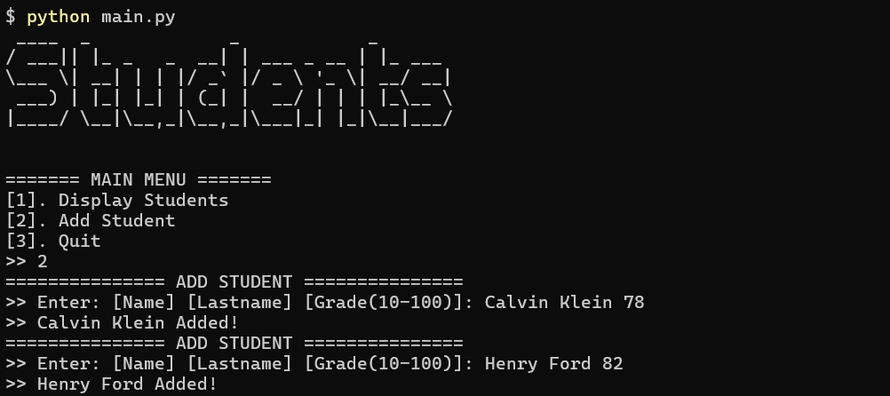
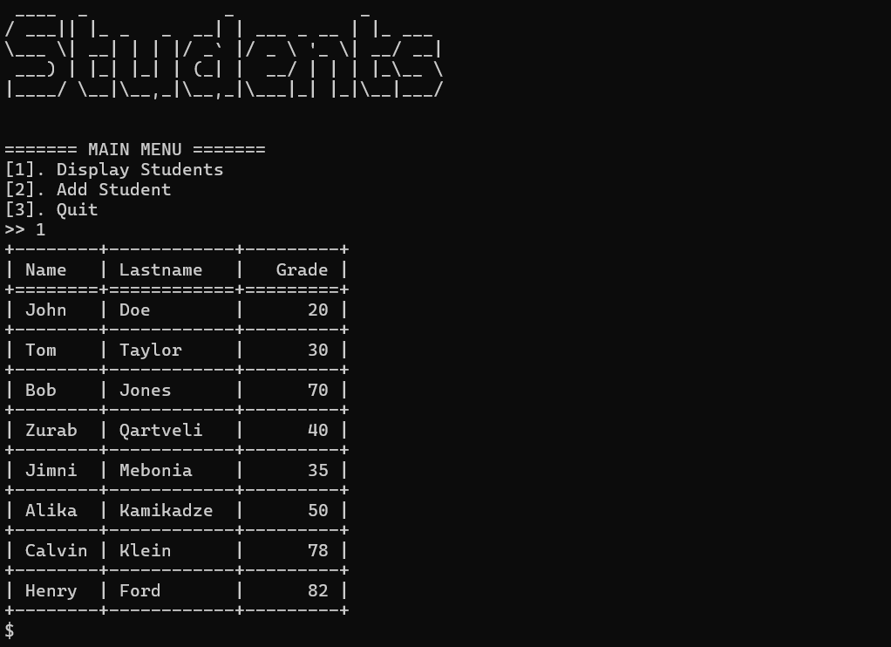

# 🚀 Students App in terminal.

Python Function and Class based terminal Students app. for learning purpose.

---

## ✨ Features
- ✅ Beautiful list for showing Students by tabulate
- ✅ Add Student using csv.DictWriter and csv.DictReader
- ✅ main menu decorated by Pyfiglet

---

## 📦 Installation

Clone the repository and install dependencies:

```bash
python -m venv env
# for Windwos 
env\Scripts\activate
# Mac/Linux
source env/bin/activate
```
```bash
mkdir main_folder
cd main_folder
git clone https://github.com/giorgi-py/students.git
pip install -r required_pip_modules.txt
```

# SCREENSHOTS 


